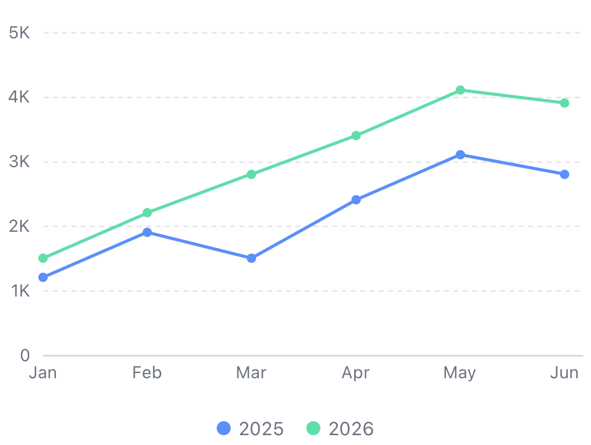
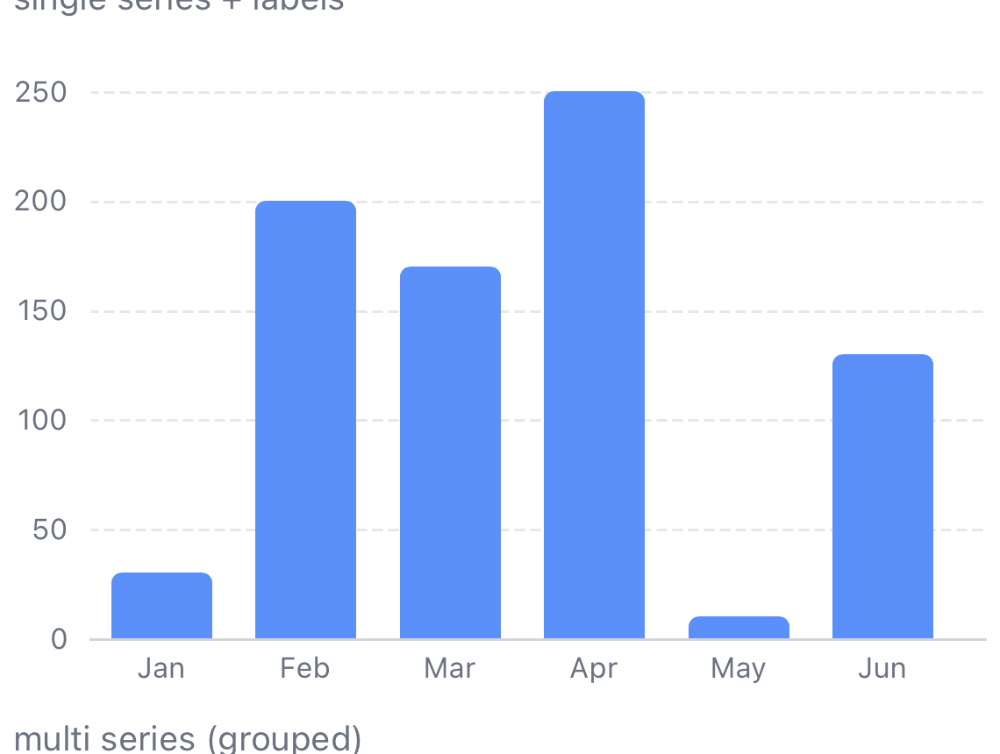
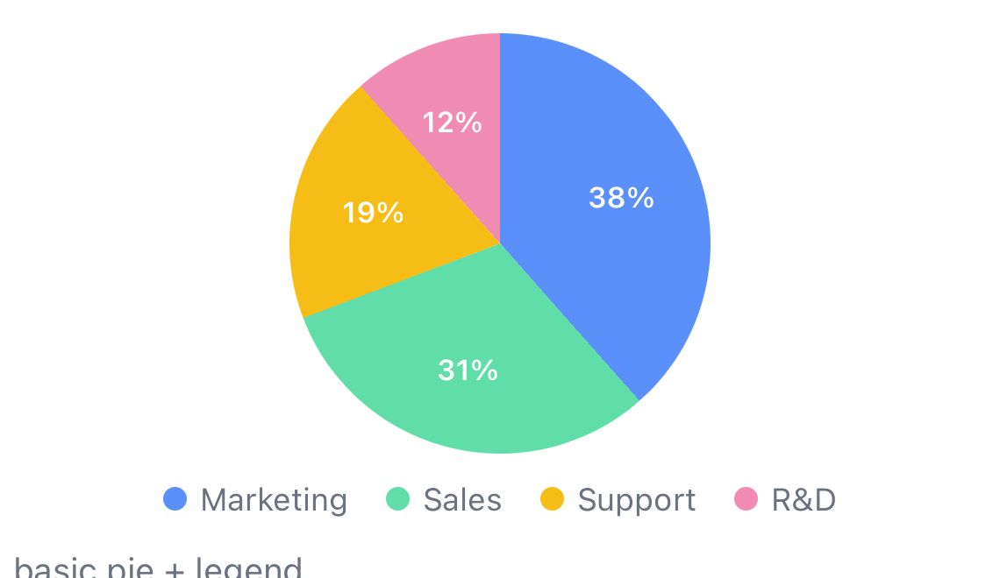
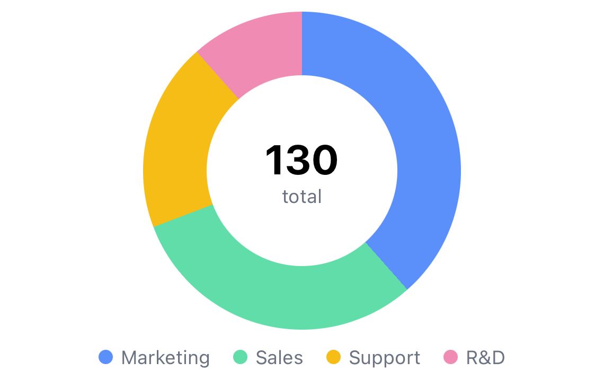

# react-native-pure-chart

> Charts built from nothing but `<View>` and `<Text>`.
> **Zero dependencies. No native modules. No SVG, no Skia.**

[](https://www.npmjs.com/package/react-native-pure-chart)
[](LICENSE)


`react-native-pure-chart` draws every axis, line, bar and pie slice with plain
React Native core components — rotated `View`s with `transformOrigin`, circular
clipping, and the `Animated` API. Nothing to link, nothing to compile.

## Why pure?

- **`npm install` and you're done.** No `pod install`, no config plugin, no
  native linking — works in **Expo Go**, bare RN, and react-native-web.
- **Survives every React Native upgrade.** Only core components are used, so
  there is no native module to break on the next RN release.
- **New Architecture native.** Built for RN 0.76+ / Fabric; animations run on
  the native driver (transform/opacity only).

## Quick start

```tsx
import { LineChart } from 'react-native-pure-chart';

<LineChart data={[30, 200, 170, 250, 10]} />;
```

That's a full chart: width fills the parent, nice-number ticks, compact
`1.2K`-style labels, and a 500 ms entrance animation — all defaults.

## Installation

```sh
npm install react-native-pure-chart
# or
yarn add react-native-pure-chart
```

Requires React Native 0.73+ (for `transformOrigin`). No other setup.

## Charts

### LineChart



```tsx
import { LineChart, formatCompact } from 'react-native-pure-chart';

const revenue = [
  { name: '2025', data: [1200, 1900, null, 2400, 3100], color: '#5B8FF9' },
  { name: '2026', data: [1500, 2200, 2800, 3400, 4100] }, // color ← palette
];

<LineChart
  data={revenue}
  height={260}
  missingValues="break" // null breaks the line ('interpolate' | 'zero')
  yAxis={{ tickCount: 4, formatLabel: (v) => `$${formatCompact(v)}` }}
  onPointPress={(e) => console.log(e.seriesName, e.label, e.value)}
/>;
```

| Prop | Type | Default | Description |
| --- | --- | --- | --- |
| `data` | `ChartData` | — | Numbers, `{value, label}` objects, or an array of series |
| `strokeWidth` | `number` | `2` | Line thickness (no upper limit) |
| `curve` | `'linear' \| 'step' \| 'monotone'` | `'linear'` | `'monotone'` draws a smooth curve that never overshoots the data |
| `area` | `boolean \| {opacity}` | `false` | Fill between the line and the zero baseline (default opacity 0.15) |
| `showDataPoints` | `boolean \| {radius, color}` | `true` | Point markers |
| `missingValues` | `'break' \| 'interpolate' \| 'zero'` | `'break'` | How `null` values are treated |
| `spacing` | `number` | auto | Px between points. Auto mode fills the width, but never squeezes below 40px — the chart grows and scrolls instead |
| `scrollable` | `boolean` | `true` | Horizontal scroll when content overflows |
| `initialScroll` | `'start' \| 'end'` | `'start'` | Initial scroll position |
| `onPointPress` | `(e: PressEvent) => void` | — | Tap on the chart |
| `selectedIndex` / `onSelectionChange` | `number \| null` | — | Controlled selection |
| `tooltip` | `boolean \| TooltipOptions` | `true` | Built-in tooltip + selection guide |
| `renderDataPoint` | `(e) => ReactNode` | — | Replace point markers |
| `renderValueLabel` | `(e) => ReactNode` | — | Always-visible label above points |

### BarChart



```tsx
import { BarChart } from 'react-native-pure-chart';

<BarChart
  data={[
    { name: 'iOS', data: [40, 55, 32, 70] },
    { name: 'Android', data: [65, 80, 45, 90] },
  ]}
  barRadius={6}
/>;

// Horizontal bars
<BarChart data={[30, 200, 170]} horizontal />;

// Stacked (positives stack up, negatives stack down; works with horizontal too)
<BarChart data={multiSeries} stacked />;
```

| Prop | Type | Default | Description |
| --- | --- | --- | --- |
| `data` | `ChartData` | — | Same shapes as LineChart |
| `barWidth` | `number` | auto | Bar width. Auto mode fills the width, but grows and scrolls instead of rendering sliver bars for many categories |
| `barRadius` | `number` | `4` | Corner radius on the value end |
| `barGap` | `number` | `2` | Gap between bars in a group |
| `groupGap` | `number` | auto | Gap between categories |
| `stacked` | `boolean` | `false` | Stack multi-series values (also combines with `horizontal`) |
| `horizontal` | `boolean` | `false` | Horizontal bars (`yAxis` still configures the value axis) |
| `onPointPress` / `selectedIndex` / `tooltip` |  |  | Same as LineChart; selection dims other categories |
| `renderValueLabel` | `(e) => ReactNode` | — | Label above each bar |

Negative values are supported — bars grow down from the zero baseline.

### PieChart




```tsx
import { PieChart } from 'react-native-pure-chart';

const budget = [
  { value: 50, label: 'Marketing' },
  { value: 40, label: 'Sales' },
  { value: 25, label: 'Support' },
];

<PieChart
  data={budget}
  innerRadius="60%" // 0 = pie, px or % = donut
  sliceLabel="percentage" // 'none' | 'label' | 'value' | 'percentage' | fn
  onSlicePress={(e) => console.log(e.slice.label, e.percentage)}
  renderCenterLabel={(selected) => (
    <Text>{selected ? `${Math.round(selected.percentage * 100)}%` : '115'}</Text>
  )}
/>;
```

| Prop | Type | Default | Description |
| --- | --- | --- | --- |
| `data` | `PieSliceDatum[]` | — | `{value, label?, color?}` per slice |
| `size` | `number` | `200` | Diameter in px |
| `innerRadius` | `number \| '60%'` | `0` | Donut hole (opaque — see Limitations) |
| `startAngle` | `number` | `0` | Degrees clockwise from 12 o'clock |
| `padAngle` | `number` | `0` | Gap between slices in degrees |
| `sliceLabel` | see above | `'none'` | On-slice labels |
| `focusOnPress` | `boolean` | `true` | Tapped slice slides outward |
| `onSlicePress` / `selectedIndex` |  |  | Selection API, same conventions |
| `renderCenterLabel` | `(selected) => ReactNode` | — | Donut center content |
| `legend` | `boolean \| LegendOptions` | `true` | Legend below the chart |

## Common props

Every chart accepts:

| Prop | Type | Default | Description |
| --- | --- | --- | --- |
| `width` | `number` | parent width | Measured with `onLayout` when omitted |
| `height` | `number` | `220` | Plot height (`size` for pies) |
| `palette` | `string[]` | built-in 10 colors | Auto-assigned series/slice colors |
| `theme` | `'light' \| 'dark' \| ChartTheme` | `'light'` | Pass `useColorScheme()` output directly |
| `animate` | `boolean \| AnimationConfig` | `true` | `{duration, delay, easing, type: 'grow' \| 'fade' \| 'none'}` |
| `xAxis` / `yAxis` | `XAxisOptions` / `YAxisOptions` | — | Ticks, grid, formatters, label styles |
| `style`, `testID`, `accessibilityLabel` |  |  | Standard RN props (a11y label auto-generated) |

The default entrance (`type: 'grow'`) is chart-aware: lines draw left to
right, bars grow from the baseline with a stagger, pies sweep clockwise.
One `Animated.Value` drives the whole chart on the native driver.

## Guides

### Dark mode

```tsx
import { useColorScheme } from 'react-native';

<LineChart data={data} theme={useColorScheme() === 'dark' ? 'dark' : 'light'} />;
```

Or pass a partial `ChartTheme` object to override individual colors.

### Handling missing data

`null` values are first-class citizens in line charts:

- `'break'` (default) — the line is interrupted, like recharts' `connectNulls={false}`
- `'interpolate'` — gaps are bridged linearly; synthetic points get no markers
- `'zero'` — nulls are treated as 0

Bars always render `null` as an empty slot (the category label remains).

### Custom tooltips

```tsx
<BarChart
  data={data}
  tooltip={{
    render: (e) => (
      <View style={styles.tip}>
        <Text>{e.seriesName}: {e.value}</Text>
      </View>
    ),
  }}
/>
```

### Axis formatting

`formatCompact` (exported) is the default y-axis formatter: `1234 → '1.2K'`,
`2500000 → '2.5M'`. Compose it for currencies or percentages:

```tsx
yAxis={{ formatLabel: (v) => `${formatCompact(v)}%` }}
```

## Limitations

Honesty section — the price of the zero-dependency concept:

- **Smooth curves cost Views.** `curve="monotone"` approximates the curve
  with short line segments (budgeted at ~400 per series). For very dense
  series prefer `'linear'`.
- **Donut holes are opaque.** The hole is a colored circle overlay, so donuts
  don't work on top of images/gradients. Set `holeColor` to match your
  background.
- **Large datasets:** each point/segment is a `View`. A few hundred points are
  fine; for thousands of points use an SVG- or Skia-based library instead.

## Migrating from 0.x

Version 2 is a complete rewrite with **no backward compatibility**. The old
`<PureChart type="..." />` component is gone — import charts directly:

| 0.x | 2.x |
| --- | --- |
| `<PureChart type="line" />` | `<LineChart />` |
| `<PureChart type="bar" />` | `<BarChart />` |
| `<PureChart type="pie" />` | `<PieChart />` |
| `data={[{x, y}]}` | `data={[{value, label}]}` |
| `data={[{seriesName, data, color}]}` | `data={[{name, data, color}]}` |
| `gap` | `spacing` |
| `lineThickness` (max 10) | `strokeWidth` (unlimited) |
| `numberOfYAxisGuideLine` | `yAxis={{ tickCount }}` |
| `yAxisSymbol` | `yAxis={{ formatLabel }}` |
| `showXAxisLabel` / `showYAxisLabel` | `xAxis={{ show }}` / `yAxis={{ show }}` |
| `showEvenNumberXaxisLabel` | `xAxis={{ interval }}` |
| `initialScrollPosition` + `initialScrollTimeOut` | `initialScroll: 'start' \| 'end'` |
| `onPress(index)` | `onPointPress(event)` — full event object |
| `customValueRenderer` | `renderValueLabel` |
| `defaultColumnWidth` / `defaultColumnMargin` | `barWidth` / `groupGap` |
| `primaryColor` / `colors` | `Series.color` / `palette` |

## Development

```sh
npm install          # library dev deps
npm test             # unit tests for the pure calculation core
npm run typecheck

cd example && npm install
npx expo start       # gallery app (iOS/Android/web)
```

The `example/` app is a gallery of every chart variant, including artifact
stress tests (1° pie slices, high-contrast neighbors, missing data).

## License

MIT © [Hansol Lee](https://github.com/oksktank)
